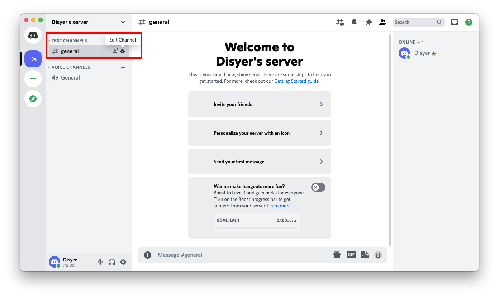
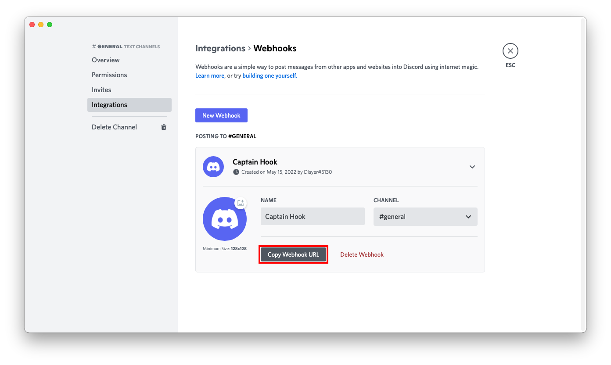
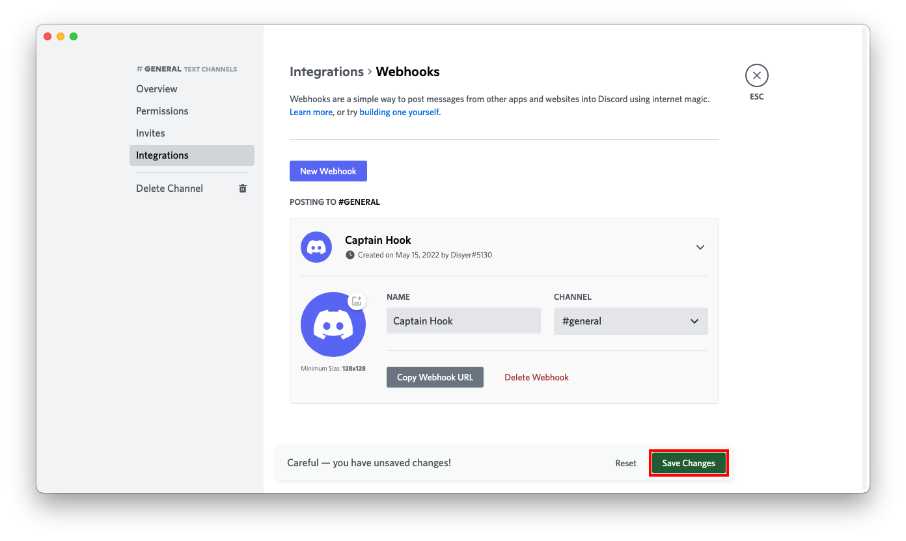

# Discord

## URL Format

Your Discord Webhook-URL will look like this:

!!! info ""
    <https://discord.com/api/webhooks/__`webhookid`__/__`token`>__

The shoutrrr service URL should look like this:

!!! info ""
    discord://__`token`__@__`webhookid`__[?thread_id=__`threadid`__]

### Thread Support

To send messages to a specific thread in a Discord channel, include the `thread_id` query parameter in the service URL with the ID of the target thread. For example:

!!! info ""
    discord://__`token`__@__`webhookid`__?thread_id=123456789

You can obtain the `thread_id` by right-clicking a thread in Discord and selecting "Copy ID" (requires Developer Mode to be enabled in Discord settings).

--8<-- "docs/services/discord/config.md"

## Creating a webhook in Discord

1. Open your channel settings by first clicking on the gear icon next to the name of the channel.


2. In the menu on the left, click on *Integrations*.


3. In the menu on the right, click on *Create Webhook*.


4. Set the name, channel, and icon to your liking and click the *Copy Webhook URL* button.


5. Press the *Save Changes* button.


6. Format the service URL:

```url
https://discord.com/api/webhooks/693853386302554172/W3dE2OZz4C13_4z_uHfDOoC7BqTW288s-z1ykqI0iJnY_HjRqMGO8Sc7YDqvf_KVKjhJ
                                 └────────────────┘ └──────────────────────────────────────────────────────────────────┘
                                     webhook id                                    token

discord://W3dE2OZz4C13_4z_uHfDOoC7BqTW288s-z1ykqI0iJnY_HjRqMGO8Sc7YDqvf_KVKjhJ@693853386302554172?thread_id=123456789
          └──────────────────────────────────────────────────────────────────┘ └────────────────┘ └─────────────────┘
                                          token                                    webhook id           thread id
```
